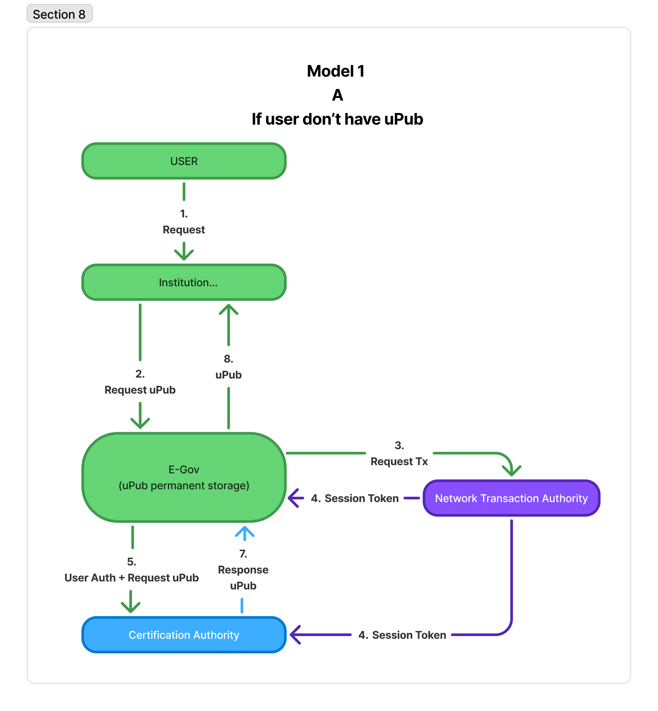
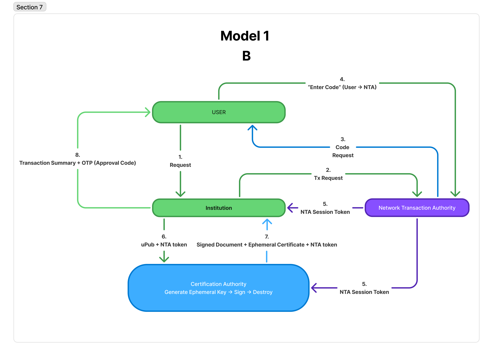
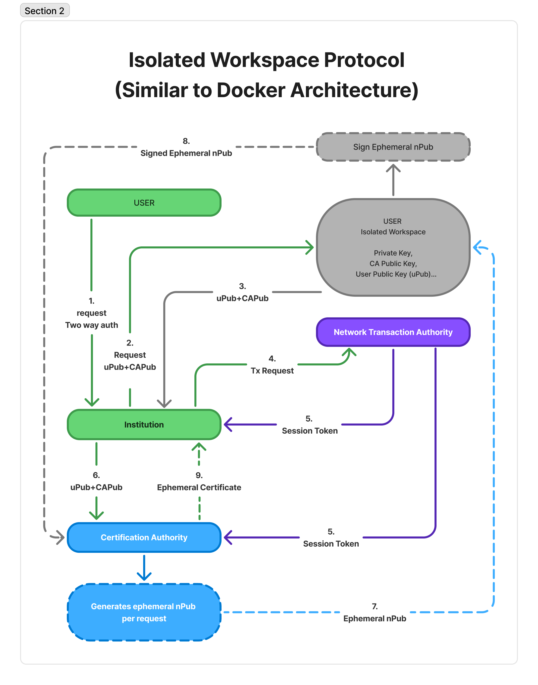
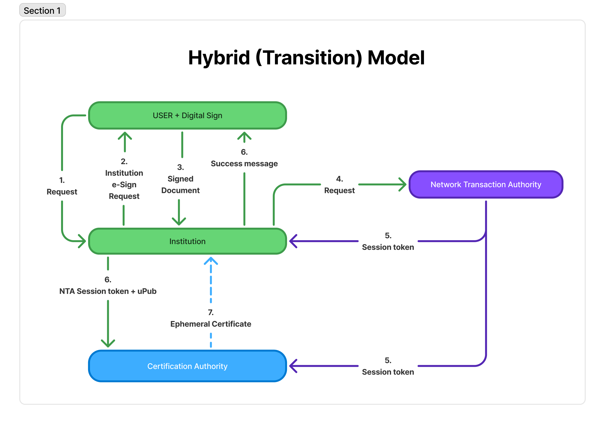
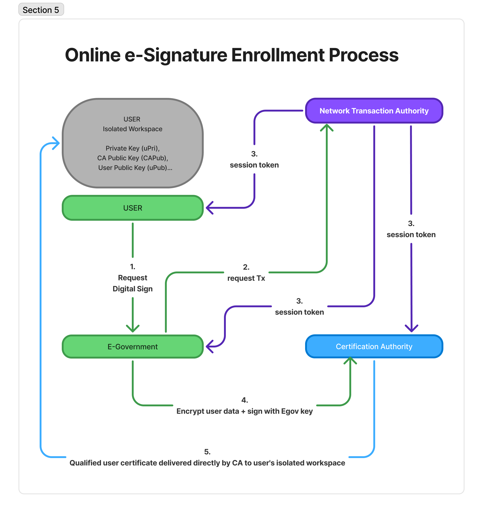

# E-İmza Sistemi Modelleri

Bu proje, Türkiye'de elektronik imza sistemleri için geliştirilmiş farklı mimarileri ve süreçleri içermektedir. Projede yer alan modeller, güvenli elektronik işlemlerin gerçekleştirilmesi için çeşitli yaklaşımlar sunmaktadır.

## 📋 İçindekiler

- [Genel Bakış](#genel-bakış)
- [Model 1: Tüm Resmi İşlemlerde E-İmza Dönemi](#model-1-tüm-resmi-i̇şlemlerde-e-i̇mza-dönemi)
  - [Model 1A: İlk Kayıt - Kişiye Özel Genel Anahtar Temini](#model-1a-i̇lk-kayıt---kişiye-özel-genel-anahtar-temini-upub)
  - [Model 1B: Çevrim İçi Resmi Evrak İmzalama Süreci](#model-1b-çevrim-i̇çi-resmi-evrak-i̇mzalama-süreci)
- [Model 2: İzole Çalışma Alanı Protokolü](#model-2-i̇zole-çalışma-alanı-protokolü)
- [Model 3: Hibrit (Geçiş) Modeli](#model-3-hibrit-geçiş-modeli)
- [Model 4: Çevrim İçi E-İmza Kayıt Süreci](#model-4-çevrim-i̇çi-e-i̇mza-kayıt-süreci)
- [Teknik Gereksinimler](#teknik-gereksinimler)

## 🎯 Genel Bakış

Bu e-imza sistemi modelleri, Türkiye'nin elektronik imza altyapısında kullanılan çeşitli senaryoları kapsamaktadır. Her model, farklı kullanıcı durumları ve güvenlik gereksinimlerini karşılamak üzere tasarlanmıştır.

### Temel Bileşenler

- **USER**: Son kullanıcı/Vatandaş
- **Institution/E-Government**: Kurumsal sistemler (e-Devlet, Banka, Vergi Dairesi vb.)
- **Network Transaction Authority (NTA)**: Ağ işlem otoritesi
- **Certification Authority (CA)**: Sertifika otoritesi
- **Isolated Workspace**: İzole çalışma ortamı

---

## 🏛️ Model 1: Tüm Resmi İşlemlerde E-İmza Dönemi
### (Tüm Vatandaşların E-İmza Sahibi Olması)

Bu model, tüm vatandaşların elektronik imza sahibi olduğu ve tüm resmi işlemlerin e-imza ile gerçekleştirildiği dönemi kapsamaktadır. Model 1, iki alt süreçten oluşmaktadır.

---

### 🔐 Model 1A: İlk Kayıt - Kişiye Özel Genel Anahtar Temini (uPub)

Bu model, henüz uPub (kullanıcı public key) sahibi olmayan vatandaşlar için e-Devlet sisteminde kalıcı anahtar saklama sürecidir.

#### Süreç Akışı

1. **Vatandaş İsteği**: Vatandaş herhangi bir kuruma (Banka, Hastane, Vergi Dairesi vb.) başvuru yapar
2. **uPub Talebi**: Kurum, e-Devlet'ten vatandaş için uPub talebinde bulunur
3. **İşlem Talebi (Tx Request)**: e-Devlet, NTA'dan süreci başlatmasını ister
4. **Oturum Tokeni**: NTA tüm taraflara session token dağıtımı yapar
5. **Kullanıcı Kimlik Doğrulama + uPub Talebi**: e-Devlet vatandaş kimliğini doğrular ve CA'dan uPub talebi yapar
6. **Sertifika İşlemi**: CA tarafından kalıcı uPub üretimi gerçekleştirilir
7. **uPub Yanıtı**: CA'dan e-Devlet'e uPub yanıtı gönderilir
8. **uPub Saklama**: e-Devlet sistemi uPub'ı kalıcı olarak saklar ve kuruma bildirir

**Not**: Bu modelde vatandaşa fiziksel bir uPub teslim edilmez, e-Devlet sistemi uPub'ı güvenli bir şekilde muhafaza eder.

#### Diyagram

#### Belgeler
- [Model 1A ile ilgili akademik makale için tıklayın](docs/model_1a_academic_document.md)
- [Model 1A ile ilgili white paper için tıklayın](docs/model_1a_white_paper.md)

---

### 🔑 Model 1B: Çevrim İçi Resmi Evrak İmzalama Süreci

Bu model, zaten uPub'a sahip vatandaşların rutin e-imza işlemlerini gerçekleştirdiği süreci ele alır.

#### Süreç Akışı

1. **Vatandaş İsteği**: Vatandaş kuruma işlem talebinde bulunur
2. **İşlem Talebi**: Kurum NTA'ya işlem talebi (Tx Request) gönderir
3. **Oturum Tokeni**: NTA, Kurum ve CA'ya session token dağıtır
4. **uPub İletimi**: Kurum CA'ya uPub gönderir
5. **İmzalı Belge Talebi**: Kurum CA'dan imzalı belge talebi yapar (Code Request)
6. **Onay Kodu Talebi**: CA doğrudan vatandaşa "X kurumunun sağladığı A belgesini imzalamak için aşağıdaki kodu girin" şeklinde onay kodu talep eder
7. **Kod Girişi**: Vatandaş CA'ya onay kodunu girer ("Enter Code")
8. **İmzalı Belge Teslimi**: CA kuruma imzalı belge + geçici sertifika gönderir
9. **İşlem Özeti**: CA vatandaşa işlem özeti + onay kodu (OTP) gönderir

#### CA İşlemleri
CA'da gerçekleşen işlem: "Generate Ephemeral Key → Sign → Destroy" (Geçici anahtar üret → İmzala → İmha et)

#### Diyagram

#### Belgeler
- [Model 1B ile ilgili akademik makale için tıklayın](docs/model_1b_academic_paper.md)
- [Model 1B ile ilgili white paper için tıklayın](docs/model_1b_white_paper.md)

---

## 🛡️ Model 2: İzole Çalışma Alanı Protokolü (5070 sayılı Elektronik İmza Kanunu'na uygun)

Docker benzeri mimari ile güvenli işlem ortamı sağlayan gelişmiş güvenlik modelidir. 

### Özellikler

- Docker benzeri konteyner mimarisi
- İki yönlü kimlik doğrulama (Two way auth)
- İzole çalışma ortamı (Isolated Workspace)
- Gelişmiş anahtar yönetimi (Private Key, CA Public Key, User Public Key)
- Geçici nPub (ephemeral public key) kullanımı

### Süreç Akışı

1. **İki Yönlü Kimlik Doğrulama**: Kullanıcı ile kurum arasında karşılıklı doğrulama talebi
2. **Anahtar Talebi**: Kurum CA'dan uPub + CAPub talebi yapar
3. **İzole Ortam Kurulumu**: Kurum kullanıcının izole çalışma alanına uPub + CAPub sağlar
4. **İşlem Talebi**: Kurum NTA'ya işlem talebi (Tx Request) gönderir
5. **Oturum Tokeni**: NTA, Kurum ve CA'ya session token dağıtır
6. **Yetkili Kopya**: CA kuruma yetkili uPub + CAPub kopyasını gönderir
7. **Geçici nPub Üretimi**: CA'nın geçici anahtar servisi her talep için ephemeral nPub üretir
8. **İmzalı Geçici nPub Teslimatı**: İmzalı ephemeral nPub kullanıcının izole çalışma alanına teslim edilir
9. **Geçici Sertifika**: CA kuruma geçici sertifikayı gönderir

### Diyagram

### Belgeler
- [Model 2 ile ilgili akademik makale için tıklayın](docs/model_2_academic_document.md)
- [Model 2 ile ilgili white paper için tıklayın](docs/model_2_white_paper.md)

---

## 🔄 Model 3: Hibrit (Geçiş) Modeli

Bu model, mevcut geleneksel sistemlerden yeni e-imza sistemine geçiş sürecinde kullanılan hibrit yaklaşımdır.

### Özellikler

- Dijital imza entegrasyonu (USER + Digital Sign)
- Mevcut e-imza altyapısı ile uyumluluk
- Kurumsal e-imza süreçleri
- NTA ve CA arasında koordinasyon
- Geçiş dönemi esnekliği

### Süreç Akışı

1. **Kullanıcı Talebi**: Kullanıcı kuruma işlem talebinde bulunur
2. **Kurumsal E-İmza Talebi**: Kurum kullanıcıdan dijital imza ile kurumsal e-imza talebi yapar
3. **İmzalı Belge**: Kullanıcı kuruma imzalı belge gönderir
4. **İşlem Talebi**: Kurum NTA'ya işlem talebi gönderir
5. **Oturum Tokeni**: NTA, Kurum ve CA'ya session token dağıtır
6. **CA İletişimi**: Kurum CA'ya NTA session token + uPub gönderir
7. **Geçici Sertifika**: CA kuruma geçici sertifika gönderir
8. **Başarı Mesajı**: Kurum kullanıcıya başarı mesajı gönderir

### Diyagram

### Belgeler
- [Model 3 ile ilgili akademik makale için tıklayın](docs/model_3_academic_document.md)
- [Model 3 ile ilgili white paper için tıklayın](docs/model_3_white_paper.md)

---

## 📝 Model 4: Çevrim İçi E-İmza Kayıt Süreci

Vatandaşların tamamen çevrim içi ortamda e-imza sertifikası almalarını sağlayan gelişmiş kayıt sürecidir.

### Özellikler

- İzole çalışma ortamı entegrasyonu
- Doğrudan CA teslim sistemi
- Çoklu güvenlik protokolleri
- E-Government anahtarı ile veri şifreleme
- Nitelikli kullanıcı sertifikası (Qualified user certificate)

### Süreç Akışı

1. **Dijital İmza Talebi**: Kullanıcı e-Devlet'ten dijital imza talebi yapar
2. **İşlem Talebi**: e-Devlet NTA'ya işlem talebi (Request Tx) gönderir
3. **Çoklu Oturum Dağıtımı**: NTA, e-Devlet, CA ve kullanıcıya session token dağıtır
4. **Veri Şifreleme ve İmzalama**: e-Devlet kullanıcı verisini şifreler ve e-Devlet anahtarı ile imzalayarak CA'ya gönderir
5. **Doğrudan Sertifika Teslimi**: CA nitelikli kullanıcı sertifikasını doğrudan kullanıcının izole çalışma alanına teslim eder

### Anahtar Yönetimi
İzole çalışma alanında:
- Private Key (uPri)
- CA Public Key (CAPub)  
- User Public Key (uPub)

### Diyagram

### Belgeler
- [Model 4 ile ilgili akademik makale için tıklayın](docs/model_4_academic_document.md)
- [Model 4 ile ilgili white paper için tıklayın](docs/model_4_white_paper.md)

---

## ⚙️ Teknik Gereksinimler

### Güvenlik Standartları

- **PKI Altyapısı**: Public Key Infrastructure desteği
- **SSL/TLS**: Güvenli iletişim protokolleri
- **Oturum Yönetimi**: Güvenli token tabanlı oturum yönetimi
- **Şifreleme**: AES-256, RSA-2048 minimum standartları
- **İki Yönlü Kimlik Doğrulama**: Mutual authentication desteği

### Sistem Gereksinimleri

- **İzole Ortam**: Docker veya benzeri konteyner teknolojisi
- **Veritabanı**: Güvenli sertifika ve anahtar deposu
- **Ağ Güvenliği**: Firewall ve intrusion detection systems
- **Audit Trail**: Tüm işlemlerin kayıt altına alınması
- **Session Management**: Çoklu oturum yönetimi kapasitesi

### Uyumluluk

- **ETSI Standartları**: Avrupa elektronik imza standartları
- **Türk Standartları**: TSE ve BTK düzenlemelerine uyumluluk
- **Uluslararası Standartlar**: ISO/IEC 27001, Common Criteria
- **eIDAS Uyumluluğu**: Avrupa elektronik kimlik düzenlemelerine uyum

### Model Karşılaştırması

| Model | Kullanım Amacı | Güvenlik Seviyesi | Karmaşıklık | uPub Yönetimi |
|-------|----------------|-------------------|--------------|---------------|
| **Model 1A** | İlk uPub kaydı | Orta | Düşük | e-Devlet'te kalıcı saklama |
| **Model 1B** | Rutin e-imza işlemleri | Orta | Düşük | Sistemde mevcut uPub kullanımı |
| **Model 2** | Yüksek güvenlik gerektiren işlemler | Çok Yüksek | Yüksek | İzole ortamda çoklu anahtar yönetimi |
| **Model 3** | Geçiş dönemi işlemleri | Orta | Orta | Hibrit anahtar yönetimi |
| **Model 4** | Online sertifika kayıt | Yüksek | Orta | İzole ortam + doğrudan CA teslim |

---

## 🤝 Katkıda Bulunma

Projeye katkıda bulunmak için lütfen [CONTRIBUTING.md](CONTRIBUTING.md) dosyasını inceleyiniz.

---

## 📞 İletişim

Sorularınız için: [e-imza-destek@example.com](mailto:e-imza-destek@example.com)

**Son güncelleme**: Eylül 2025