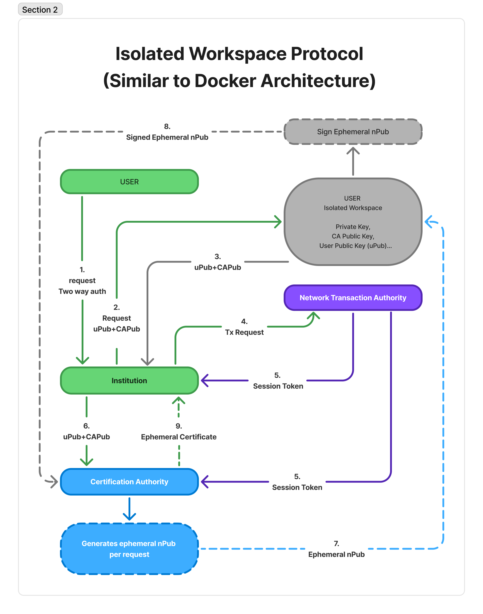
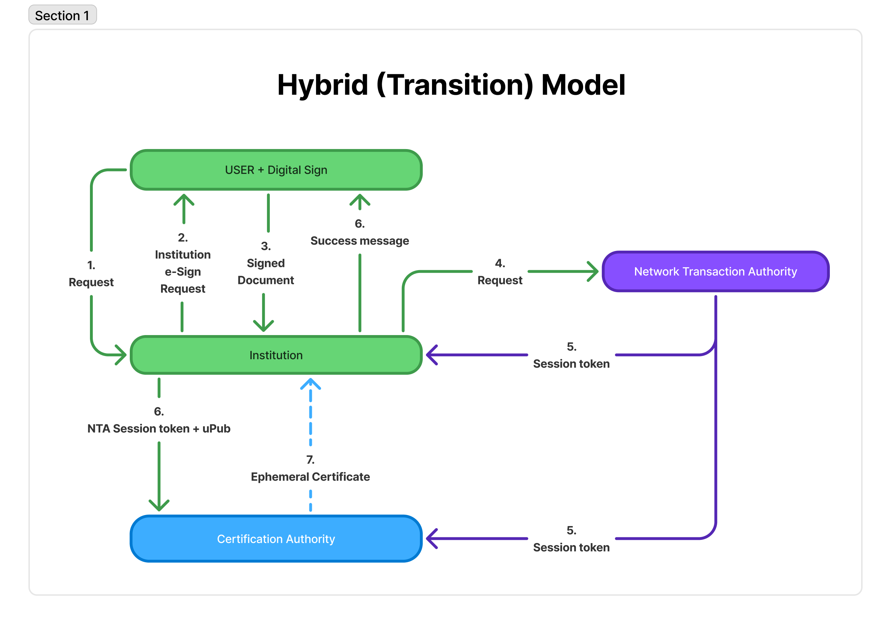
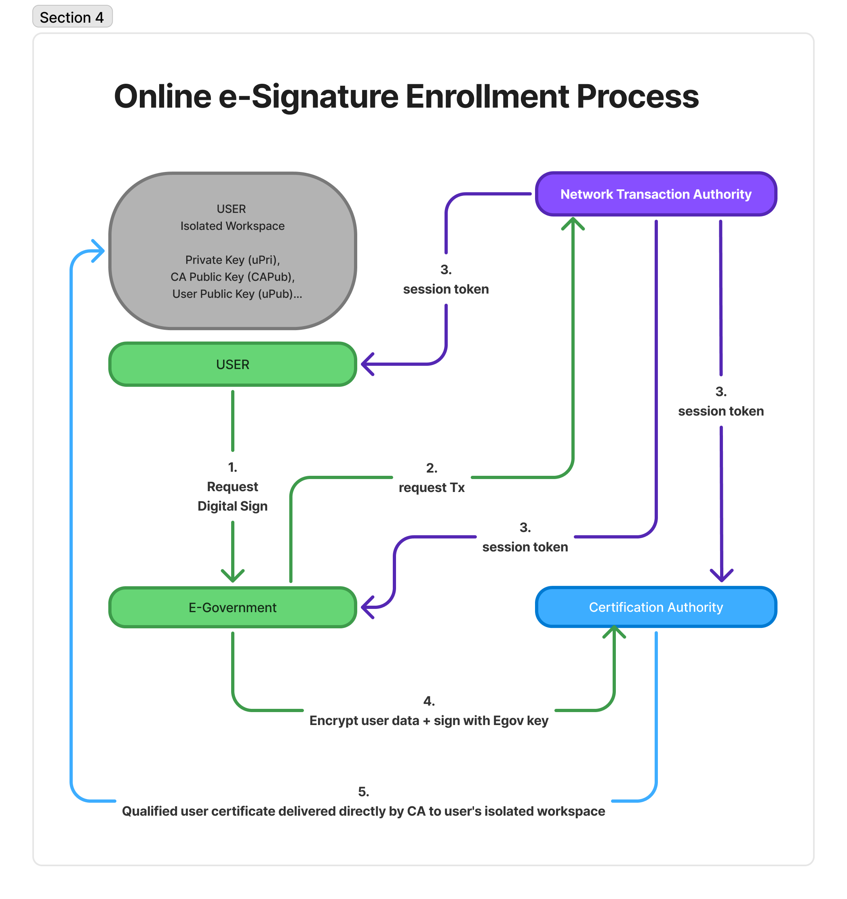

# Ephemeral E-İmza Güvenlik Sistemi

**Yazar:** Güven Acar  
**Tarih:** Eylül 2025

---

## Genel Bakış

Bu proje, kalıcı özel anahtar saklama zorunluluğunu ortadan kaldırarak e-imza güvenliğinde devrimsel bir yaklaşım sunar. Sistem, **tek kullanımlık (ephemeral) anahtarlar** ve **geçici sertifikalar** üzerine inşa edilmiştir. Bir anahtar ele geçirildiğinde yalnızca tek bir işlemi etkiler—geçmiş veya gelecekteki işlemler tamamen güvende kalır.

---

## Felsefi Kırılma Noktası

Bu sistem dijital kimlik ve güvenlikte yeni bir paradigma başlatır:

### Toplumsal Dönüşüm
- **E-imzasız işlem döneminin sonu:** Artık tüm resmi, hukuki ve mali işlemler kriptografik olarak imzalanacak
- **Evrensel e-imza sahipliği:** Tıpkı herkesin bir T.C. Kimlik Numarası olduğu gibi, herkesin bir e-imzası olacak
- **Arka planda güvenlik:** Yaşlı veya teknik bilgiye sahip olmayan bireyler bile farkında olmadan kendi e-imzaları ile işlem yapacak
- **Dijital uçurumun kapanması:** Gençten yaşlıya herkes bu ekosisteme dahil olur

### Ekonomik Paradigma Değişimi
- **Mevcut sistem:** Her vatandaş 500-1.500 TL e-imza cihazı alsın
- **Yeni sistem:** Devlet altyapısı ile evrensel erişim
- **Maliyet avantajı:** Kullanıcılar için donanım yatırımı sıfır
- **Ölçek ekonomisi:** 80+ milyon vatandaş için merkezi altyapı

### Güvenlik Devrimi
- **Geleneksel risk:** Bir anahtar ele geçirilmesi = tüm geçmiş işlemler şüpheli
- **Ephemeral yaklaşım:** Ele geçirilme sadece o işlemi etkiler
- **İleri güvenlik:** TLS protokollerinde olduğu gibi geriye dönük güvenlik
- **Dolandırıcılığın sonu:** İzinsiz işlem, kimlik hırsızlığı ve işlem inkârı neredeyse imkansız

---

## Sistem Modelleri

### Model 1: E-Devlet Merkeziyetçi Model

**Hedef Kullanıcı:** Yaşlı bireyler, sabit gelirli vatandaşlar, teknik karmaşıklık istemeyen herkes

**Temel Kavram:**
Tüm işlem koordinasyonu, anahtar üretimi ve sertifika dağıtımı devlet altyapısı tarafından yönetilir. Kullanıcıların anahtar üretmesine veya saklamasına gerek yoktur—sadece mevcut e-Devlet kimlik bilgileri ile giriş yaparlar.

**Toplumsal Etki:**
- **Kapsayıcılık:** Kimse süreç dışında kalmaz, teknik engeller kaldırılır
- **Görünmez güvenlik:** Kullanıcı farkında olmadan her işlemi imzalı yapar
- **Hızlı katılım:** Mevcut e-Devlet kimlik bilgileri ile anında kullanım

**İşlem Akışı:**
1. Kullanıcı e-Devlet'e giriş yapar ve işlem başlatır
2. Güvenen taraf (banka, kurum) talebi e-Devlet'e iletir
3. e-Devlet CA'dan geçici sertifika talep eder
4. NTA oturum belirteci üretir ve taraflara dağıtır
5. e-Devlet veriyi şifreler ve Token-Egov ile imzalar
6. CA tek kullanımlık sertifika döner
7. e-Devlet imzayı güvenen tarafa iletir
8. İmzalı belge kullanıcıya sunulur

  
   
  <em>Şekil 1: E-Devlet Merkeziyetçi Model</em>

### Model 2: İzole Çalışma Alanı Protokolü

**Hedef Kullanıcı:** Maksimum güvenlik isteyen herkes (teknik bilgi gerektirmez)

**Temel Kavram:**
Kullanıcının cihazında izole bir ortam (Docker benzeri) oluşturulur. Tüm anahtar işlemleri bu güvenli ortamda yapılır ve işlem bitince imha edilir. Kullanıcı sadece resmi uygulamayı indirir ve kullanır—teknik ayrıntıları bilmesine gerek yoktur.

**Güvenlik Avantajları:**
- **Kimlikten bağımsız imza:** Anahtar materyali kişisel verilerden bağımsız
- **Çalınsa bile kimlik sızmaz:** Özel anahtar ile kimlik bilgisi arasında bağlantı yok
- **Sınırlı etki:** Tek kullanımlık anahtarlar sayesinde saldırı sadece o işlemi etkiler
- **Platform agnostik:** PC'de Docker, mobilde TEE/Güvenli Kutu

**İşlem Akışı:**
1. Kullanıcı işlem başlatır, 2FA ile kimliğini doğrular
2. İzole çalışma alanı oluşturulur
3. uPub ve CAPub yüklenir
4. TxID ve özet hash üretilir
5. NTA oturum belirteci üretir
6. Kurum uPub+CAPub+token'ı CA'ya iletir
7. CA geçici nPub üretir ve kullanıcıya yollar
8. İzole ortam nPub'u imzalar, CA'ya yollar
9. CA doğrular ve geçici sertifika döner

  
   
  <em>Şekil 2: İzole Çalışma Alanı Protokolü</em>

### Model 3: Hibrit (Geçiş) Model

**Hedef Kullanıcı:** Mevcut e-imza sahipleri, geçiş döneminde karma kullanım isteyenler

**Temel Kavram:**
Mevcut e-imza sahiplerinin sistem dışında kalmamasını sağlar. Arka planda tüm işlemler ephemeral sertifikalar ile güvence altına alınır.

**Geçiş Stratejisi:**
- **Yumuşak entegrasyon:** Eski ve yeni kullanıcılar aynı ekosistemde
- **Güvenlik standartlaşması:** Tüm işlemler aynı ephemeral seviyeye yükselir
- **Kullanıcı alışkanlıkları korunur:** Mevcut cihazlar kullanılmaya devam eder

**İşlem Akışı:**
1. Kullanıcı kuruma mevcut e-imza ile başvurur
2. Kurum işlem özetini kullanıcıya iletir
3. Kullanıcı kendi cihazı ile imzalar
4. Kurum NTA'dan işlem başlatmasını talep eder
5. NTA belirteci hem kuruma hem CA'ya gönderir
6. Kurum token + uPub bilgisini CA'ya yollar
7. CA geçici sertifika üretir ve kuruma döner
8. Kurum işlemi tamamlar

  
   
  <em>Şekil 3: Hibrit (Geçiş) Model</em>

### Model 4: Çevrimiçi E-İmza Edinme Süreci

**Hedef Kullanıcı:** Yeni e-imza alacaklar, seyahatte olanlar, hızlı çözüm isteyenler

**Temel Kavram:**
Kullanıcı kendi cihazında anahtar çifti oluşturur ve e-imza edinir. Fiziksel CA ziyareti gereksizdir.

**Devrimsel Özellikler:**
- **Fiziksel başvuruya son:** Tatilde bile e-imza alınabilir
- **Anında kullanım:** Dakikalar içinde tam nitelikli e-imza
- **Self-servis:** Kullanıcı kontrolünde tüm süreç

**İşlem Akışı:**
1. Kullanıcı e-Devlet portalı üzerinden e-imza talebi başlatır
2. E-Devlet NTA'dan oturum belirteci ister
3. Belirteç hem e-Devlet'e hem CA'ya iletilir
4. Anahtar çifti kullanıcı cihazında üretilir
5. E-Devlet kamu anahtarı ve belirteci CA'ya yollar
6. CA sertifikayı üretir ve izole ortama teslim eder
7. Kullanıcı artık gerçek bir e-imza sahibi olur

  
   
  <em>Şekil 4: Çevrimiçi E-İmza Edinme Süreci</em>

---

## Güvenlik Modeli

### Protokol Seviyesi Güvenlik

**Ephemeral Anahtar Yaşam Döngüsü:**
- Her işlem için benzersiz anahtar çifti
- İşlem sonrası otomatik imha
- İleri güvenlik garantisi

**Sahiplik Kanıtı:**
- nPub soru-cevap mekanizması
- Özel anahtar sahipliği kanıtı zorunlu
- Tekrar saldırısı koruması

**Oturum Yönetimi:**
- 30 saniye geçerlilik süresi
- İşlem bağlama (TxID)
- Belirteç ele geçirme koruması

**Sertifika Yaşam Döngüsü:**
- Tek kullanımlık sertifikalar
- İşlem sonrası otomatik iptal
- CRL/OCSP entegrasyonu

### Güvenlik Varsayımları

Bu protokol aşağıdaki varsayımlar altında güvenlidir:

**Altyapı Seviyesi (Mevcut Sorumluluklar):**
- CA HSM güvenliği
- e-Devlet kimlik doğrulama altyapısı güvenliği
- Ağ taşıma güvenliği (TLS/HTTPS)
- NTA kullanılabilirliği ve bütünlüğü

**Uygulama Seviyesi:**
- Kriptografik güvenli rastgele sayı üretimi
- Doğru oturum belirteci yönetimi
- İzole çalışma alanı bütünlüğü (TEE/Docker/VM)
- Cihaz seviyesinde temel güvenlik hijyeni

**Hukuki Çerçeve:**
- 5070 sayılı E-İmza Kanunu uyumu
- eIDAS düzenlemesi uyumu
- KVKK mahremiyet gereksinimleri

---

## Tehdit Modeli

### Ele Alınan Tehditler
- **Uzun vadeli anahtar ele geçirilmesi:** Ephemeral yaklaşım ile çözülür
- **Tekrar saldırıları:** Oturum belirteci ve TxID bağlama ile önlenir
- **Kimlik ifşası:** Kimlik bilgisi imzada görünmez
- **İşlem inkârı:** Kriptografik bağlama ile önlenir
- **Ortadaki adam:** TLS ve belirteç doğrulama ile korunur

### Kapsam Dışı (Altyapı Seviyesi)
- **CA altyapısı ele geçirilmesi:** Genel PKI güvenlik problemi
- **Devlet gözetimi:** Siyasi/hukuki konu, protokol kapsam dışı
- **Cihaz zararlı yazılımı:** Genel bilgisayar güvenliği problemi
- **Sosyal mühendislik:** Kullanıcı eğitimi konusu
- **Fiziksel cihaz hırsızlığı:** Cihaz seviyesinde güvenlik sorumluluğu

---

## Hukuki Uyumluluk

### Türkiye
- **5070 Sayılı E-İmza Kanunu:** Tam uyumluluk
- **KVKK:** Tasarımda mahremiyet yaklaşımı
- **BTK Düzenlemeleri:** NTA koordinasyon modeli

### Uluslararası
- **eIDAS Düzenlemesi:** AB standartları uyumu
- **Ortak Kriterler:** Güvenlik değerlendirme standartları
- **ISO 27001:** Bilgi güvenliği yönetimi

---

## Kullanım Senaryoları

### Bankacılık Sektörü
**Model 1 Senaryosu:**
- Yaşlı müşteri ATM'den para transferi
- Arka planda otomatik e-imza
- Kullanıcı teknik ayrıntı görmez

**Model 2 Senaryosu:**
- Kurumsal müşteri yüksek hacimli transfer
- İzole çalışma alanında maksimum güvenlik
- Denetim izi ve uyumluluk gereksinimleri

### Kamu Hizmetleri
**Evrensel Erişim:**
- Tüm vatandaşlar e-imza sahibi
- Ruhsat başvurularından vergi beyannamelerine
- Kağıt işlem döneminin sonu

**Yaşlı Dostu:**
- Engelsiz teknik kullanım
- Mevcut e-Devlet alışkanlıkları korunur
- Emekli maaş işlemleri bile imzalı

### Seyahat Senaryoları
**Model 4 ile:**
- Tatilde acil e-imza ihtiyacı
- Çevrimiçi kayıt süreci
- Dakikalar içinde kullanıma hazır

---

## Ekonomik Etki

### Maliyet Analizi
**Kullanıcı Perspektifi:**
- Geleneksel: 500-1.500 TL e-imza cihazı + yıllık ücretler
- Ephemeral: Sıfır donanım maliyeti
- ROI: Anında pozitif getiri

**Devlet Perspektifi:**
- Altyapı yatırımı: Tek seferlik
- Ölçek avantajı: 80+ milyon kullanıcı
- Operasyonel verimlilik: Kağıtsızlaşma tasarrufu

**Toplumsal Faydalar:**
- Artan dijital kapsayıcılık
- Bürokrasi verimliliği
- Dolandırıcılık azaltma faydaları

---

## Teknik Gereksinimler

### En Az Sistem Gereksinimleri

**PC/Masaüstü:**
- Docker Desktop veya VM desteği
- Modern web tarayıcısı (Chrome 90+, Firefox 88+)
- 4GB RAM (izole çalışma alanı için)
- Donanım güvenlik modülü (isteğe bağlı)

**Mobil:**
- Android 8+ (TEE desteği)
- iOS 12+ (Güvenli Kutu)
- Biyometrik kimlik doğrulama yeteneği
- 2GB kullanılabilir depolama

### Platform-Özel İzolasyon

**Android:**
- Samsung Knox Konteyner
- Android İş Profili
- Donanım destekli Anahtar Deposu
- ARM TrustZone TEE

**iOS:**
- Güvenli Kutu
- Donanım Güvenlik Modülü entegrasyonu
- Anahtarlık Hizmetleri
- Touch/Face ID entegrasyonu

**PC:**
- Docker konteynerleme
- Windows Sandbox
- VMware/VirtualBox VM
- Donanım HSM entegrasyonu

---

## Uygulama Yol Haritası

### Faz 1: Pilot Program (6 ay)
- Model 1 uygulaması
- Seçili kamu kurumları
- 10.000 kullanıcı testi

### Faz 2: Bankacılık Entegrasyonu (6 ay)
- Model 2 uygulaması
- Pilot banka ortaklıkları
- 100.000 kullanıcı kapasitesi

### Faz 3: Hibrit Geçiş (12 ay)
- Model 3 uygulaması
- Mevcut e-imza sahibi entegrasyonu
- 1 milyon+ kullanıcı ölçeği

### Faz 4: Ulusal Dağıtım (18 ay)
- Tüm modeller aktif
- 80+ milyon vatandaş kapasitesi
- Uluslararası genişleme hazırlığı

---

## Sorumluluk Sınırları

### Protokol Sorumluluğu
Bu sistem aşağıdaki güvenlik özelliklerini garanti eder:
- Ephemeral anahtar yaşam döngüsü yönetimi
- Kriptografik işlem bağlama
- Oturum belirteci doğrulama
- Sertifika iptal işlemleri

### Altyapı Sorumluluğu (Kapsam Dışı)
Aşağıdaki konular mevcut altyapı sahiplerinin sorumluluğundadır:
- e-Devlet altyapısının kullanılabilirliği
- CA HSM güvenlik yönetimi
- Ağ seviyesi DDoS koruması
- Hükümet politikası uyumluluğu

Bu ayrım, Google Auth analojisi ile benzerdir: OAuth protokolü güvenlidir, ancak Google'ın sunucu güvenliği Google'ın sorumluluğundadır.

---

## Katkıda Bulunma

### Geliştirici Topluluğu
- GitHub deposu: [proje-bağlantısı]
- Sorun takibi ve özellik istekleri
- Güvenlik açığı bildirimi
- Belge iyileştirmeleri

### Akademik İş Birliği
- Araştırma makalesi iş birlikleri
- Güvenlik analizi ortaklıkları
- Uluslararası standartlaşma çabaları

---

## İletişim

**Proje Sahibi:** Güven Acar  
**E-posta:** guvenacar@gmail.com  
**GitHub:** https://github.com/guvenacar/e-imza-protokolu

---

## Lisans

[Lisans bilgisi eklenecek]

---

## Sonuç

Bu sistem, dijital kimlik ve e-imza alanlarında paradigmal bir değişim sunar. Güvenlik, kullanılabilirlik ve toplumsal kapsayıcılığı harmanlayarak, gerçekten evrensel bir dijital imza ekosistemi oluşturur.

Tıpkı internetin evrensel hale gelmesi gibi, bu sistem de e-imzanın her vatandaşın günlük yaşamının doğal bir parçası olmasını hedefler. Yaşından, teknik bilgisinden veya ekonomik durumundan bağımsız olarak herkesin güvenli dijital işlem yapabildiği bir gelecek vizyonumuzdur.