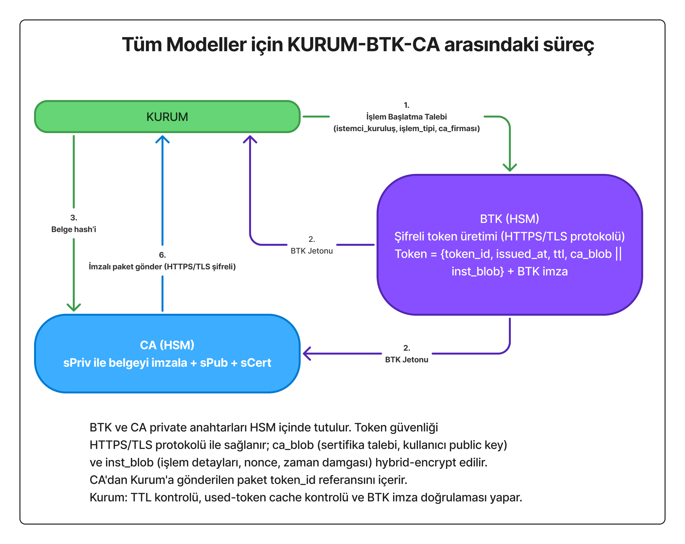

# Tek Kullanımlık E-İmza Sistemi (SUDSS)

## 1. Giriş

**Tek Kullanımlık E-İmza Sistemi (SUDSS)**, e-imza teknolojisinde devrim niteliğinde yeni bir protokol önermektedir. Bu sistem, Türkiye'yi dijital imza alanında takip eden değil **takip edilen** ülke konumuna taşıyabilecek, dünyada henüz hiçbir ülkede uygulanmayan benzersiz bir yaklaşımdır.

### 1.1 Mevcut Sistemin Sorunları

Bugün Türkiye'de e-imza kullanım oranı %5’in altındadır. Klasik e-imza protokolünde CA firmalarından alınan dijital imzalar, 3 yıl geçerli olmak üzere kullanıcıya teslim edilen özel cihazlarda (akıllı kart, USB token) barındırılmak zorundadır. Bu durum ciddi sorunlar yaratmaktadır:

- **Güvenlik Riski**: E-imza cihazlarının çalınması veya kaybolması halinde, dijital imza sahibinin önceki ve sonraki **tüm resmi işlemleri tehlikeye girebilmektedir**. Tek bir güvenlik ihlali, yıllarca süren işlem geçmişini ve geleceğini riske atabilir.
- **Sürekli Taşıma Zorluluğu**: Dijital imza sahipleri cihazlarını yanlarından ayıramaz. Yanında taşımasa işlem yapamaz, yanında taşısa güvenlik riski doğar.  
- **Ekonomik Engeller**: Donanım maliyetleri (500–1500 TL) ve karmaşık süreçler nedeniyle vatandaşlar e-imza kullanmaktan uzak durmaktadır.

### 1.2 Paradigma Değişimi: "İmza Atmak" Yerine "Onay Vermek"

Tek Kullanımlık E-İmza Sistemi’nin kırılma noktası şu yaklaşımdır:  
**“E-imza sahibi belgeyi imzalamaz, işlemi onaylar.”** Bu, birinin bir avukata vekalet vermesi gibidir.

Bu devrimsel paradigma ile:  
- Kullanıcı fiziksel cihaz taşımak zorunda değildir  
- Her işlem için yeni, tek kullanımlık anahtarlar ve sertifika (sPriv/sPub/sCert) üretilir  
- Bir işlemin güvenlik ihlali diğer işlemleri etkilemez  
- Cep telefonu ile saniyeler içinde güvenli imzalama mümkündür  

**Sistem nasıl çalışır:**  
E-imza sahibi resmi bir işlem başlatmak istediğinde CA (Sertifika Hizmet Sağlayıcısı), kullanıcının onayını aldıktan sonra tek kullanımlık Özel Anahtar (sPriv) ile belgenin HASH’ini imzalar ve kuruma iletir. Kurum, kullanıcı onayı ve CA sertifikasını alarak işlemi tamamlar.  

---

## 2. Mimarinin Temel İlkeleri

- **Kullanıcı belgeyi imzalamaz, yalnızca onay verir.**  
- **CA her işlem için yeni bir anahtar çifti ve sertifika (sPriv/sPub/sCert) üretir.**  
- **sPriv tek kullanımlık özel anahtardır.** İşlem sonunda geçersizdir.  
- **sPub tek kullanımlık genel anahtar** kuruma teslim edilir.  
- **sCert**, CA’nın bu işlem için imzayı gerçekten ürettiğinin kanıtıdır.  

---

### Anahtar Terminolojisi

**Kullanıcı Anahtarları (uPriv/uPub):**
- Kullanıcıya özel, kalıcı anahtar çifti
- uPriv: İzole alanda güvenle saklanır
- uPub: CA ve e-Devlet'te kayıtlıdır
- Ömrü: 3 yıl (yenilenebilir)

**İşlem Anahtarları (sPriv/sPub):**
- Her işlem için CA tarafından üretilir
- **Tek kullanımlıktır** - işlem sonunda imha edilir
- sPriv: Sadece CA'da bulunur, asla paylaşılmaz
- sPub: Herkese açık, doğrulama için kullanılır

**CA Anahtarları (CAPriv/CAPub):**
- CA'nın ana anahtar çifti
- CAPriv: HSM'de saklanır
- CAPub: Kullanıcıların izole alanında sabit olarak bulunur
- Her kullanıcı tek bir CA ile çalışır

## 3. Modeller

**Tek Kullanımlık E-İmza Sistemi, iki ana model üzerine kurgulanmıştır:**

- **Model 2 – İzole Alanlı E-İmza Protokolü (IAEP)**  
- **Model 3 – Hibrit (Geçiş) Model**

> **Not:** İlk tasarıda yer alan Model 1 (merkeziyetçi vatandaş modeli) güvenlik ve suistimal riskleri nedeniyle kaldırılmıştır. Bundan sonraki geliştirmeler Model 2 ve Model 3 üzerine yoğunlaşacaktır. Ancak ek güvenlik protokolleri ile Model 1 de değerlendirilebilir.

---

### Model 2 – İzole Alanlı E-İmza Protokolü (IAEP)

#### Model 2A – İlk Kayıt Süreci

## Model 2A – İlk Kayıt Süreci

1. **Kullanıcı → e-Devlet:** Dijital imza başvurusu

2. **e-Devlet:** Kimlik doğrulama

3. **e-Devlet → Kullanıcı:** İzole alan uygulamasını indir

4. **Kullanıcı Cihazı:** İzole alan oluşturulur, uPriv/uPub üretilir

5. **Kullanıcı:** CA seçimi yapar

6. **e-Devlet → BTK:** Kayıt işlemi başlatma

7. **BTK → e-Devlet, CA, Kullanıcı:** İşlem jetonu

8. **e-Devlet → CA (HTTPS/TLS):**
   - Kullanıcı kimlik bilgileri
   - uPub
   - e-Devlet dijital imzası

9. **CA:**
   - Kullanıcıyı kaydeder (uPub ile)
   - uCert oluşturur

10. **CA → Kullanıcı İzole Alanı:** uCert, CAPub teslim edilir

11. **Kayıt tamamlandı**

#### Model 2B – İşlem Aşaması

Bu modelde kullanıcının cihazında izole bir çalışma alanı (sandbox, docker benzeri) oluşturulur.  

1. **Kullanıcı → İzole Alan**
   İşlem Talebi

2. **Kurum → İzole Alan**
   uPub + Belge + Belge HASH'i

3. **Kurum → BTK**
   İşlem Başlatma Talebi

4. **BTK → Kurum**
   İşlem Jetonu
   
   **BTK → CA**
   İşlem Jetonu

5. **Kurum → CA**
   uPub + Belge HASH'i

6. **CA → İzole Alan**
   (sPriv + sPub + sCert)
   uPub ile şifrelenmiş
   CAPub ile imzalanmış

7. **İzole Alan → Kurum**
   signature + sPub + sCert + token_id

8. **Kurum**
   Doğrulama ve İşlem Tamamlama

### Kurum–BTK–CA Süreci

Bu şemada, BTK’nın yalnızca **işlem jetonu üreten koordinatör** rolü olduğu net biçimde gösterilir.  
BTK sürece müdahil olmaz, işlem detayına erişmez, kullanıcıya dair PII bilgisini görmez.  

1. **Kurum → BTK:**
   İşlem başlatma talebi
   • Kurum bilgisi
   • İşlem türü (örn: tapu, banka)
   • Kullanıcının seçtiği CA bilgisi
   • Zaman damgası

2. **BTK:**
   • Benzersiz işlem jetonu (Session Token) üretir
   • Jetonu veritabanına kaydeder
   • Jeton bilgileri:
     - İşlem ID
     - Kurum ID
     - CA ID
     - Oluşturma zamanı
     - Geçerlilik süresi (örn: 5 dakika)

3. **BTK → Kurum:**
   İşlem jetonu

4. **BTK → CA:**
   İşlem jetonu (aynı jeton, senkronizasyon için)

5. **Kurum → CA:**
   • uPub
   • Belge HASH'i
   • İşlem jetonu (doğrulama için)

6. **CA:**
   • Kurum ve CA bilgilerinin eşleştiğini teyit eder
   • Tek kullanımlık; sPriv, sPub, sCert üretir
   • Kurumdan gelen belge HASH'ini sPriv ile imzalar
   • Kuruma; token_id, imzalanmış HASH'i, sPub'ı, sCert'i gönderir

---

### Model 3 – Hibrit (Geçiş) Model

# Model 3 — Doğru Metin Akışı (Markdown)
1. **Kullanıcı → Kurum**
   - İşlem talebi (klasik e-imza sahibi)

2. **Kurum → Kullanıcı**  
   - Belge + HASH + "Onaylıyor musunuz?"

3. **Kullanıcı → Kurum**
   - uPriv ile imzalanmış HASH (onay imzası)
   - uPub (kimlik doğrulama için)
   ⚠️ Bu sadece "işlem onayı"dır, nihai belge imzası değil

4. **Kurum → BTK**
   - İşlem başlatma talebi: {kurum_ID, işlem_tipi, CA_ID}

5. **BTK → Kurum & CA**
   - İşlem jetonu: {token_id, zaman_mührü, TTL, ca_ID, kurum_ID} + BTK_imza

6. **Kurum → CA**
   - {Belge HASH, onay_imzası, uPub, token_id}

7. **CA İşlemleri:**  
   a) Token doğrulama (BTK imzası + TTL kontrolü)  
   b) uPub ile onay_imzasını doğrulama  
   c) uPub'dan kullanıcı kimliğini tespit edip veritabanından bilgilere erişme  
   d) Geçici anahtar çifti üretme: (sPriv, sPub)  
   e) Geçici sertifika üretme: sCert  
   f) Belge HASH'ini sPriv ile imzalama  

8. **CA → Kurum**
   - {sPriv ile imzalanmış HASH, sPub, sCert, token_id}

## CA doğrulamaları

* BTK jetonunun **imzası**, **TTL** ve **tek-kullanım** kontrolü.
* **uPub** ile **onay imzasını** doğrulama.
* **uPub**’ı kendi kayıtlarında (**CRL/OCSP/kendi dizini**) eşleştirip durumunu kontrol etme.

  * *(CA, kullanıcı sertifikasını Kurumdan almaz; kendisi tespit eder.)*
* Bu kontrollerle **kullanıcı onayını** teyit eder.

## CA üretim & imza

* **Tek kullanımlık sPriv/sPub** üretir.
* **Belge HASH’ini sPriv** ile imzalar → **sSig**.
* **sPriv** HSM içinde **derhal imha edilir**.
* **sCert** (geçici sertifika) düzenlenir; **token_id/TTL/tek-kullanım** bilgisi bağlanır.

**CA → Kurum**

* `{sSig, sPub, sCert, token_id}` (TLS).

## Kurum doğrulamaları

* **sSig**’ı **sPub** ile; **sCert**’i **CA kök/ara sertifikası**yla doğrula.
* **BTK jetonu** için **imza/TTL/tek-kullanım** kontrolü.
* İşlemi tamamla ve kaydet; **kullanıcıya sonuç bildir**.

Bu model, mevcut e-imza sahiplerinin sisteme entegrasyonu için geliştirilmiştir.  
- Kullanıcı mevcut e-imzası ile yalnızca **onay verir**, belgeyi doğrudan imzalamaz.  
- CA bu onayı doğrular, sPriv/sPub üretir ve belgeyi sPriv ile imzalar.  
- Böylece kullanıcı anahtarının sızması durumunda bile yalnızca ilgili işlem tehlikeye girer.  

---

## 4. Güvenlik ve Gizlilik Modeli

- **CA, kullanıcıların açık kimlik bilgilerini saklamaz.**  
- Kimlik doğrulama yalnızca e-Devlet veya yetkili devlet sistemi üzerinden yapılır.  
- CA sadece **uPub + işlem kanıtı** tutar. Denetim gerektiğinde e-Devlet API’si üzerinden doğrulama yapılır.  
- Böylece:  
  - **PII sızıntısı riski minimumdur**  
  - CA bir saldırı hedefi olmaktan çıkar  
  - Kimlik yönetimi devlette kalır, CA teknik bir imzalama servisi olarak çalışır  

---

## 5. Kriptolojik Zincir

- Kullanıcı **uPriv ile yalnızca onay imzası** atar.  
- CA bu onayı doğrular, **sPriv/sPub** üretir.  
- Belge **sPriv ile imzalanır, sPub ile doğrulanabilir.**  
- Kuruma teslim edilen çıktı:  
  - **İmzalı Belge**  
  - **sPub**  
  - **Geçici Sertifika (sCert)**  

Bu yapı tam bir kriptoloji döngüsü oluşturur ve “**tek imza → tek işlem**” paradigmasını sağlar.  

---

## 6. Avantajlar

- **Dağıtık Güven:** Hiçbir taraf tek başına tam yetkiye sahip değildir.  
- **Yüksek Güvenlik:** Her işlem bağımsızdır, anahtar sızıntısı zincirleme risk oluşturmaz.  
- **Ekonomik:** Devlete ek maliyet doğurmadan 80 milyon vatandaş e-imza sahibi olabilir.  
- **Mahremiyet:** CA kimlik bilgilerini saklamaz, veri ihlali riski minimumdur.  
- **Uluslararası Açılım:** AB eIDAS 2.0 gibi standartlarla uyumlu hale getirilerek Türkiye’nin dijital kimlik alanında öncü ülke olmasını sağlar.  

---

## 7. Sonuç

**İzole Alanlı E-İmza Protokolü (IAEP)**, klasik e-imza modelinden farklı olarak:  
- Kullanıcı yükünü ortadan kaldırır  
- İşlemleri izole eder  
- Güvenliği artırır  
- Türkiye’yi dijital imza teknolojisinde dünyada lider konuma taşıyabilecek bir altyapı sunar.  

**Bu sistem sadece teknik bir yenilik değil; dijital toplum yaratma vizyonudur.**
