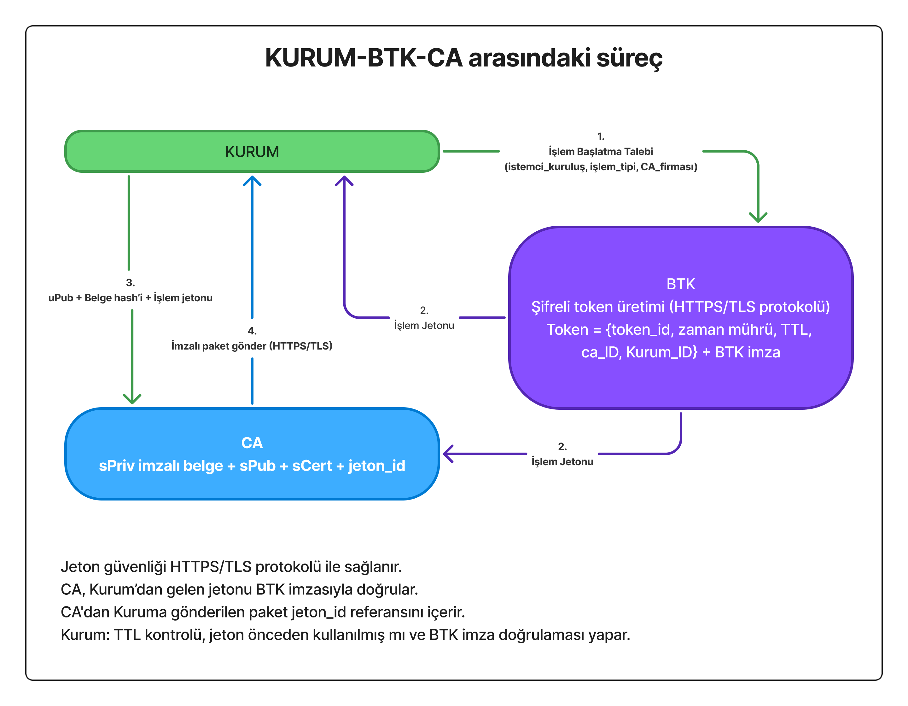

# Tek Kullanımlık E-İmza Sistemi (SUDSS)

## 1. Giriş

**Tek Kullanımlık E-İmza Sistemi (SUDSS)**, e-imza teknolojisinde devrim niteliğinde yeni bir protokol önermektedir. Bu sistem, Türkiye'yi dijital imza alanında takip eden değil **takip edilen** ülke konumuna taşıyabilecek, dünyada henüz hiçbir ülkede uygulanmayan benzersiz bir yaklaşımdır.

### 1.1 Mevcut Sistemin Sorunları

Bugün Türkiye'de e-imza kullanım oranı %5’in altındadır. Klasik e-imza protokolünde CA firmalarından alınan dijital imzalar, 3 yıl geçerli olmak üzere kullanıcıya teslim edilen özel cihazlarda (akıllı kart, USB token) barındırılmak zorundadır. Bu durum ciddi sorunlar yaratmaktadır:

- **Güvenlik Riski**: E-imza cihazlarının çalınması veya kaybolması halinde, dijital imza sahibinin önceki ve sonraki **tüm resmi işlemleri tehlikeye girebilmektedir**. Tek bir güvenlik ihlali, yıllarca süren işlem geçmişini ve geleceğini riske atabilir.
- **Sürekli Taşıma Zorluluğu**: Dijital imza sahipleri cihazlarını yanlarından ayıramaz. Yanında taşımasa işlem yapamaz, yanında taşısa güvenlik riski doğar.  
- **Ekonomik Engeller**: Donanım maliyetleri (500–1500 TL) ve karmaşık süreçler nedeniyle vatandaşlar e-imza kullanmaktan uzak durmaktadır.

### 1.2 Paradigma Değişimi: "İmza Atmak" Yerine "Onay Vermek"

Tek Kullanımlık E-İmza Sistemi’nin kırılma noktası şu yaklaşımdır:  
**“E-imza sahibi belgeyi imzalamaz, işlemi onaylar.”** Bu, birinin bir avukata vekalet vermesi gibidir.

Bu devrimsel paradigma ile:  
- Kullanıcı fiziksel cihaz taşımak zorunda değildir  
- Her işlem için yeni, tek kullanımlık anahtarlar ve sertifika (sPriv/sPub/sCert) üretilir  
- Bir işlemin güvenlik ihlali diğer işlemleri etkilemez  
- Cep telefonu ile saniyeler içinde güvenli imzalama mümkündür  

**Sistem nasıl çalışır:**  
E-imza sahibi resmi bir işlem başlatmak istediğinde CA (Sertifika Hizmet Sağlayıcısı), kullanıcının onayını aldıktan sonra tek kullanımlık Özel Anahtar (sPriv) ile belgenin HASH’ini imzalar ve kuruma iletir. Kurum, kullanıcı onayı ve CA sertifikasını alarak işlemi tamamlar.  

---

## 2. Mimarinin Temel İlkeleri

- **Kullanıcı belgeyi imzalamaz, yalnızca onay verir.**  
- **CA her işlem için yeni bir anahtar çifti ve sertifika (sPriv/sPub/sCert) üretir.**  
- **sPriv tek kullanımlık özel anahtardır.** İşlem sonunda geçersizdir.  
- **sPub tek kullanımlık genel anahtar** kuruma teslim edilir.  
- **sCert**, CA’nın bu işlem için imzayı gerçekten ürettiğinin kanıtıdır.  

---

### Anahtar Terminolojisi

**Kullanıcı Anahtarları (uPriv/uPub):**
- Kullanıcıya özel, kalıcı anahtar çifti
- uPriv: İzole alanda güvenle saklanır
- uPub: CA ve e-Devlet'te kayıtlıdır
- Ömrü: 3 yıl (yenilenebilir)

**İşlem Anahtarları (sPriv/sPub):**
- Her işlem için CA tarafından üretilir
- **Tek kullanımlıktır** - işlem sonunda imha edilir
- sPriv: Sadece CA'da bulunur, asla paylaşılmaz
- sPub: Herkese açık, doğrulama için kullanılır

**CA Anahtarları (CAPriv/CAPub):**
- CA'nın ana anahtar çifti
- CAPriv: HSM'de saklanır
- CAPub: Kullanıcıların izole alanında sabit olarak bulunur
- Her kullanıcı tek bir CA ile çalışır

## 3. Modeller

**Tek Kullanımlık E-İmza Sistemi, iki ana model üzerine kurgulanmıştır:**

- **Model 2 – İzole Alanlı E-İmza Protokolü (IAEP)**  
- **Model 3 – Hibrit (Geçiş) Model**

> **Not:** İlk tasarıda yer alan Model 1 (merkeziyetçi vatandaş modeli) güvenlik ve suistimal riskleri nedeniyle kaldırılmıştır. Bundan sonraki geliştirmeler Model 2 ve Model 3 üzerine yoğunlaşacaktır. Ancak ek güvenlik protokolleri ile Model 1 de değerlendirilebilir.

---

### Model 2 – İzole Alanlı E-İmza Protokolü (IAEP)

#### Model 2A – İlk Kayıt Süreci

1. Kullanıcı → e-Devlet:
   Kimlik doğrulama (TC Kimlik No + Şifre/Biyometrik)

2. e-Devlet → Kullanıcı:
   Kimlik onayı

3. Kullanıcı → CA Seçimi:
   Hangi CA ile çalışmak istediğini seçer (örn: E-Güven, Kamu SM)

4. Kullanıcı Cihazında:
   • Seçilen CA için izole alan oluşturulur
   • İzole alanda uPriv/uPub anahtar çifti üretilir
   • Seçilen CA'nın CAPub'u izole alana yüklenir

5. Kullanıcı → CA:
   uPub + e-Devlet kimlik doğrulama jetonu

6. CA → e-Devlet API:
   Kimlik doğrulama jetonunu kontrol eder

7. e-Devlet → CA:
   Kullanıcı kimliği onayı

8. CA:
   • uPub'u kullanıcı hesabına kaydeder
   • Kullanıcı sertifikası (uCert) oluşturur
   • uCert'i yayınlar

9. CA → Kullanıcı İzole Alanı:
   uCert (kullanıcı sertifikası)

10. İzole Alan:
    uCert'i saklar ve ilk kayıt tamamlanır

#### Model 2B – İşlem Aşaması

Bu modelde kullanıcının cihazında izole bir çalışma alanı (sandbox, docker benzeri) oluşturulur.  

1. Kullanıcı → İşlem Talebi → Kurum

2. Kurum → İzole Alan:
   uPub + Belge + HASH + CAPub
   (İzole alan provision edilir)

3. İzole Alan → Kurum:
   uPub + CAPub (kayıt isteği)

4. Kurum → BTK: İşlem Başlatma

5. BTK → Kurum & CA: İşlem Jetonu

6. Kurum → CA: 
   uPub + Belge HASH'i

7. CA → İzole Alan:
   sPub (tek kullanımlık genel anahtar) 

8. İzole Alanda:
   • sPub'u CAPub ile doğrula
   • sPub'u uPriv ile imzala (onay)
   • İmzalı sPub → CA'ya gönder

9. CA → Kurum:
   • sPriv ile İmzalanmış Belge HASH'i
   • sPub (doğrulama için)
   • Geçici Sertifika (sCert)

  

### Kurum–BTK–CA Süreci

Bu şemada, BTK’nın yalnızca **işlem jetonu üreten koordinatör** rolü olduğu net biçimde gösterilir.  
BTK sürece müdahil olmaz, işlem detayına erişmez, kullanıcıya dair PII bilgisini görmez.  

1. Kurum → BTK:
   İşlem başlatma talebi
   • Kurum bilgisi
   • İşlem türü (örn: tapu, banka)
   • Kullanıcının seçtiği CA bilgisi
   • Zaman damgası

2. BTK:
   • Benzersiz işlem jetonu (Session Token) üretir
   • Jetonu veritabanına kaydeder
   • Jeton bilgileri:
     - İşlem ID
     - Kurum ID
     - CA ID
     - Oluşturma zamanı
     - Geçerlilik süresi (örn: 5 dakika)

3. BTK → Kurum:
   İşlem jetonu

4. BTK → CA:
   İşlem jetonu (aynı jeton, senkronizasyon için)

5. Kurum → CA:
   • uPub
   • Belge HASH'i
   • İşlem jetonu (doğrulama için)

6. CA:
   • İşlem jetonunu BTK ile doğrular
   • Jetonun geçerliliğini kontrol eder
   • Kurum ve CA bilgilerinin eşleştiğini teyit eder

7. CA → İşlem Devam Eder:
   Jeton geçerliyse Model 2B akışı başlar

8. İşlem Tamamlandığında:
   CA → BTK: İşlem tamamlandı bildirimi
   BTK → Jetonu pasif yapar (tek kullanımlık)

---

### Model 3 – Hibrit (Geçiş) Model

1. Kullanıcı → Kurum:
   İşlem talebi (mevcut e-imza cihazı ile)

2. Kurum → Kullanıcı:
   • Belge + Belge HASH'i
   • "Onaylıyor musunuz?" sorusu

3. Kullanıcı:
   • Belgeyi inceler
   • Mevcut e-imza cihazını taktar (USB token/akıllı kart)
   • Belge HASH'ini mevcut özel anahtarı ile imzalar
   • Bu sadece ONAY imzasıdır, belgeyi imzalamaz

4. Kullanıcı → Kurum:
   Klasik e-imza ile imzalanmış Belge HASH'i (onay imzası)

5. Kurum → BTK:
   İşlem başlatma talebi

6. BTK → Kurum & CA:
   İşlem jetonu

7. Kurum → CA:
   • Kullanıcının klasik e-imza sertifikası
   • Onay imzası (klasik e-imza ile imzalanmış HASH)
   • Belge HASH'i
   • İşlem jetonu

8. CA:
   • Klasik e-imza sertifikasını doğrular
   • Onay imzasını klasik sertifika ile kontrol eder
   • Kullanıcı onayını teyit eder
   • Yeni tek kullanımlık sPriv/sPub üretir

9. CA:
   • Belge HASH'ini sPriv ile imzalar
   • sPriv'i kalıcı olarak imha eder
   • Geçici sertifika (sCert) oluşturur

10. CA → Kurum:
    • sPriv ile imzalanmış Belge HASH'i
    • sPub (doğrulama için)
    • Geçici sertifika (sCert)
    • İşlem jetonu

11. Kurum:
    • İmzalı HASH'i sPub ile doğrular
    • sCert'i CA'nın ana sertifikası ile doğrular
    • İşlem jetonunu kontrol eder
    • İşlemi tamamlar ve kaydeder

Bu model, mevcut e-imza sahiplerinin sisteme entegrasyonu için geliştirilmiştir.  
- Kullanıcı mevcut e-imzası ile yalnızca **onay verir**, belgeyi doğrudan imzalamaz.  
- CA bu onayı doğrular, sPriv/sPub üretir ve belgeyi sPriv ile imzalar.  
- Böylece kullanıcı anahtarının sızması durumunda bile yalnızca ilgili işlem tehlikeye girer.  

---

## 4. Güvenlik ve Gizlilik Modeli

- **CA, kullanıcıların açık kimlik bilgilerini saklamaz.**  
- Kimlik doğrulama yalnızca e-Devlet veya yetkili devlet sistemi üzerinden yapılır.  
- CA sadece **uPub + işlem kanıtı** tutar. Denetim gerektiğinde e-Devlet API’si üzerinden doğrulama yapılır.  
- Böylece:  
  - **PII sızıntısı riski minimumdur**  
  - CA bir saldırı hedefi olmaktan çıkar  
  - Kimlik yönetimi devlette kalır, CA teknik bir imzalama servisi olarak çalışır  

---

## 5. Kriptolojik Zincir

- Kullanıcı **uPriv ile yalnızca onay imzası** atar.  
- CA bu onayı doğrular, **sPriv/sPub** üretir.  
- Belge **sPriv ile imzalanır, sPub ile doğrulanabilir.**  
- Kuruma teslim edilen çıktı:  
  - **İmzalı Belge**  
  - **sPub**  
  - **Geçici Sertifika (sCert)**  

Bu yapı tam bir kriptoloji döngüsü oluşturur ve “**tek imza → tek işlem**” paradigmasını sağlar.  

---

## 6. Avantajlar

- **Dağıtık Güven:** Hiçbir taraf tek başına tam yetkiye sahip değildir.  
- **Yüksek Güvenlik:** Her işlem bağımsızdır, anahtar sızıntısı zincirleme risk oluşturmaz.  
- **Ekonomik:** Devlete ek maliyet doğurmadan 80 milyon vatandaş e-imza sahibi olabilir.  
- **Mahremiyet:** CA kimlik bilgilerini saklamaz, veri ihlali riski minimumdur.  
- **Uluslararası Açılım:** AB eIDAS 2.0 gibi standartlarla uyumlu hale getirilerek Türkiye’nin dijital kimlik alanında öncü ülke olmasını sağlar.  

---

## 7. Sonuç

**İzole Alanlı E-İmza Protokolü (IAEP)**, klasik e-imza modelinden farklı olarak:  
- Kullanıcı yükünü ortadan kaldırır  
- İşlemleri izole eder  
- Güvenliği artırır  
- Türkiye’yi dijital imza teknolojisinde dünyada lider konuma taşıyabilecek bir altyapı sunar.  

**Bu sistem sadece teknik bir yenilik değil; dijital toplum yaratma vizyonudur.**
