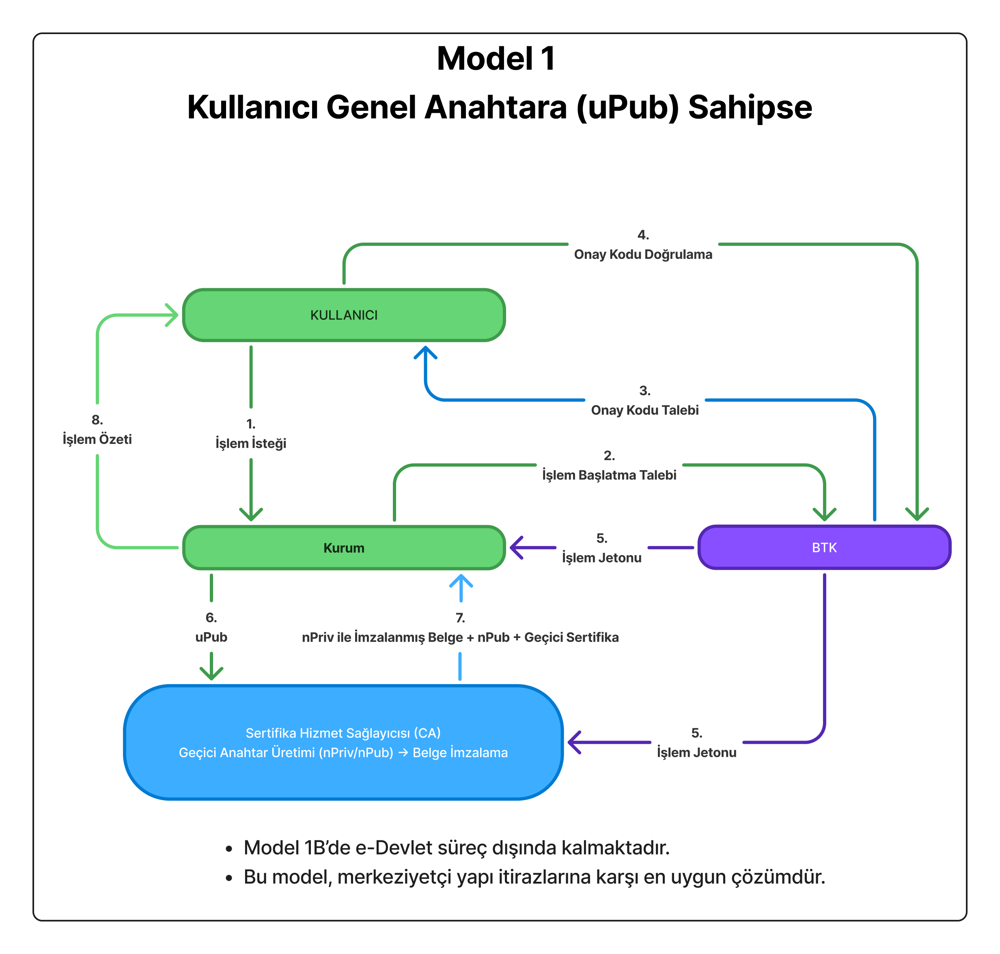
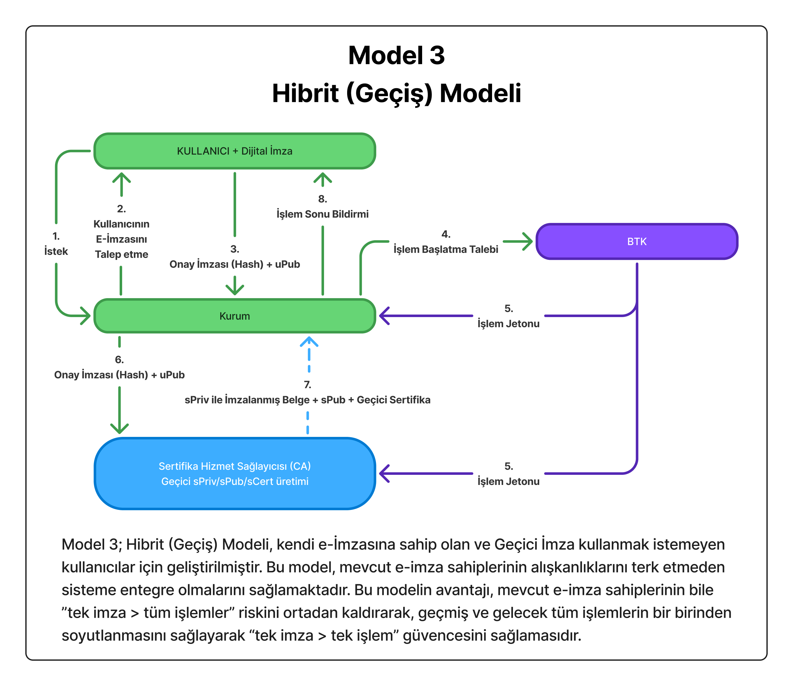

# Tek Kullanımlık E-İmza Sistemi (SUDSS) 

## 1. Giriş

**Tek Kullanımlık E-İmza Sistemi**, e-imza teknolojisinde devrim niteliğinde yeni bir protokol önermektedir. Bu sistem, Türkiye'yi dijital imza alanında takip eden değil **takip edilen** ülke konumuna taşıyabilecek, dünyada henüz hiçbir ülkede uygulanmayan benzersiz bir yaklaşımdır.

### 1.1 Mevcut Sistemin Sorunları

Bugün Türkiye'de e-imza kullanım oranı %5'in altındadır. Klasik e-imza protokolünde CA firmalarından alınan dijital imzalar 3 yıl geçerli olmak üzere kullanıcıya teslim edilen özel cihazlarda (akıllı kart, USB token) barındırılmak zorundadır. Bu durum ciddi sorunlar yaratmaktadır:

**Güvenlik Riski**: E-imza cihazlarının çalınması veya kaybolması halinde, dijital imza sahibinin önceki ve sonraki **tüm resmi işlemleri tehlikeye girebilmektedir**. Tek bir güvenlik ihlali, yıllarca süren işlem geçmişini ve geleceğini riske atabilir.

**Sürekli Taşıma Zorluluğu**: Dijital imza sahipleri e-imza cihazlarını hiçbir zaman yanlarından ayıramaz. Yanında taşıdığı e-imza cihazını her zaman gözünün önünde, elinin altında bulundurmak zorundadır. Bir iş adamı tatile gitmek istese, e-imza cihazını yanına alması bir sorun, almaması başka bir sorun olmaktadır:
- Yanına almasa acil bir işlem yapmak istese yapamaz
- Yanına alsa saklayabileceği en uygun yer otel odasının kasası olabilir.

**Ekonomik Engeller**: Donanım maliyetleri (500-1500 TL) ve karmaşık süreçler nedeniyle vatandaşlar e-imza kullanmaktan uzak durmaktadır.

### 1.2 Paradigma Değişimi: "İmza Atmak" Yerine "Onay Vermek"

Tek Kullanımlık E-İmza Sistemi'nin kırılma noktası şu yaklaşımdır: **"E-imza sahibi belgeyi imzalamaz, işlemi onaylar"**.

Bu devrimsel paradigmada:
- Kullanıcı fiziksel cihaz taşımak zorunda değildir
- Her işlem için yeni, tek kullanımlık anahtarlar ve sertifika (sPriv/sPub/sCert) üretilir
- Bir işlemin güvenlik ihlali diğer işlemleri etkilemez
- Cep telefonu ile saniyeler içinde güvenli imzalama mümkündür

Sistem nasıl çalışır: E-imza sahibi bir kişi resmi bir işlem yapmak istediğinde CA (Sertifika Hizmet Sağlayıcısı) tarafından, kullanıcının onayı alındıktan sonra kullanıcı adına tek kullanımlık Özel Anahtar (sPriv) ile belgenin HASH'ini imzalar ve kuruma iletir. Kurum, kullanıcı onayı ve CA firmasının sertifikasını alarak işlemi tamamlar. Böylece her işlem birbirinden izole edilir, donanım maliyeti sıfırlanır ve devlet altyapısına ek maliyet doğmadan **80 milyon vatandaşın e-imza sahibi olması mümkün hale gelir**.

## 2. Mimarinin Temel İlkeleri

* **Kullanıcı belgeyi imzalamaz, yalnızca onay verir.**
* **CA her işlem için yeni bir anahtar çifti ve sertifika (sPriv/sPub/sCert) üretir** ve belgeyi tek kullanımlık özel anahtarla (Single-Use Private Key - sPriv) ile imzalar.
* **sPriv tek kullanımlık Özel Anahtar** → sPriv işlem sonunda geçersizdir. Böylece geçmiş/gelecek işlemler birbirinden izole edilir.
* **sPub tek kullanımlık Genel Anahtar** ilgili kuruma teslim edilerek imzanın geçerliği ispatlanır.
* **sCert** CA firmasının bu işlem için imzaladığı belgenin ve sPub'ın, CA firması tarafından sağlandığının kanıtı olarak Kurum tarafından saklanır.

## 3. Modeller

**Tek Kullanımlık E-İmza Protokolü 3 ana model üzerine kurgulanmıştır.**

* **Tüm vatandaşları Tek Kullanımlık E-İmza Modeline dahil eden Model 1**
* **Profesyonel kullanıcılar için geliştirilmiş Model2**
* **Halihazırda dijital imza sahibi kullanıcılar için Model3**

**Terminoloji**
* **Kurum (Institution):** E-İmza ile işlem yürütmek isteyen resmi veya özel kurumlar. Banka, noterlik, tapu müdürlüğü vs.
* **Bilgi Teknolojileri ve İletişim Kurumu (Network Transaction Authority):** BTK kurumlar arası koordinasyonu sağlayarak eş zamanlı işlem başlatmakla yetkili kurumdur. Sürece doğrudan müdahil olmaz. İşlemleri göremez, kullanıcı hakkında bilgi sahibi olamaz. BTK yerine farklı bir kuruluş da ikame edilebilir.
* **Sertifika Hizmet Sağlayıcısı (Certification Authority):** Sertifika veren yetkili kurum. Bizim modelimizde sertifika kuruluşları çok daha işlevsel hale gelecektir. Mevcut pozisyonlarını korudukları gibi yapılan her işten küçük bir komisyon alarak gelirlerini artıracaklardır. Bu durum sertifika firmaları için yeni bir iş fırsatı doğuracaktır.

### Model 1A – İlk Kayıt

Kullanıcının ilk kez sisteme kayıt olduğu aşamadır. Kullanıcı e-Devlet üzerinden uPub talep eder, BTK işlem jetonunu üretir, CA uPub'ı oluşturur ve e-Devlet'e kaydeder. CA kullanıcıya ait açık kimlik bilgisini saklamaz, yalnızca uPub + e-Devlet imzalı kayıt kanıtını saklar.

### Model 1B – İşlem Aşaması

Artık e-Devlet süreç dışında kalır. Kullanıcı kurum ile işlem başlatır, BTK işlem jetonu üretir, CA kullanıcının onayını doğrular, sPriv/sPub üretir ve belgeyi imzalar. sPriv işlem sonunda imha edilir.

### Model 2 – İzole Çalışma Alanı Protokolü

### Model 2A – ilk kayıt süreci 

### Model 2B – İşlem Aşaması

Kullanıcının cihazında izole bir çalışma alanı (sandbox) oluşturulur. CA sPub üretip kullanıcıya gönderir. Kullanıcı sPub'ı kendi uPriv'u ile imzalar (signed sPub). CA signed sPub'ı kullanıcının uPub'ı ile doğrular, böylece kullanıcının onayı kanıtlanır. CA belgeyi sPriv ile imzalar, sPriv'i imha eder, kuruma sPub + geçici sertifika + imzalı belge gönderilir.

### Model 3 – Hibrit (Geçiş) Model

Bu model, mevcut e-imza sahiplerinin sisteme entegrasyonu içindir. Kullanıcı mevcut e-imzasıyla yalnızca onay verir, belgeyi doğrudan imzalamaz. CA bu onayı doğrular, sPriv/sPub üretir ve belgeyi sPriv ile imzalar. Böylece kullanıcı anahtarının sızması durumunda bile sadece ilgili işlem tehlikeye girer.

## 4. Güvenlik ve Gizlilik Modeli

Bu protokolde CA, kullanıcıların **açık kimlik bilgilerini saklamaz**. Kimlik doğrulama yalnızca e-Devlet tarafından yapılır. CA sadece uPub + kimlik kanıtı tutar ve ileride bir denetim gerektiğinde e-Devlet API'si üzerinden kimlik doğrulaması yapılır.

Bu yaklaşım sayesinde:

* **PII sızıntısı riski minimumdur.**
* CA bir saldırı hedefi olmaktan çıkar.
* Kimlik yönetimi devlette kalır, CA sadece teknik bir imzalama servisi olarak çalışır.

## 5. Kriptolojik Zincir

* Kullanıcı uPriv ile yalnızca **onay imzası** atar.
* CA bu onayı doğrular, sPriv/sPub üretir.
* Belge **sPriv** ile imzalanır, **sPub** ile doğrulanabilir.
* Kuruma teslim edilen çıktı: **İmzalı Belge + sPub + Geçici Sertifika**.

Bu yapı tam bir kriptoloji döngüsü oluşturur ve tek imza → tek işlem paradigmasını sağlar.

## 6. Avantajlar

* **Dağıtık Güven:** Hiçbir taraf tek başına tam yetkiye sahip değildir.
* **Yüksek Güvenlik:** Her işlem bağımsızdır, anahtar sızıntısı zincirleme risk oluşturmaz.
* **Ekonomik:** Devlete ek maliyet doğurmadan 80 milyon vatandaş e-imza sahibi olabilir.
* **Mahremiyet:** CA kimlik bilgilerini saklamaz, veri ihlali riski minimumdur.

## 7. Sonuç

Tek Kullanımlık E-İmza Sistemi, klasik e-imza modelinden farklı olarak kullanıcıların yükünü ortadan kaldırır, işlemleri izole eder ve Türkiye'yi dijital imza teknolojisinde dünyada lider konuma taşıyabilecek bir altyapı sunar.

**Bu sistem sadece teknik bir yenilik değil; dijital toplum yaratma vizyonudur.**