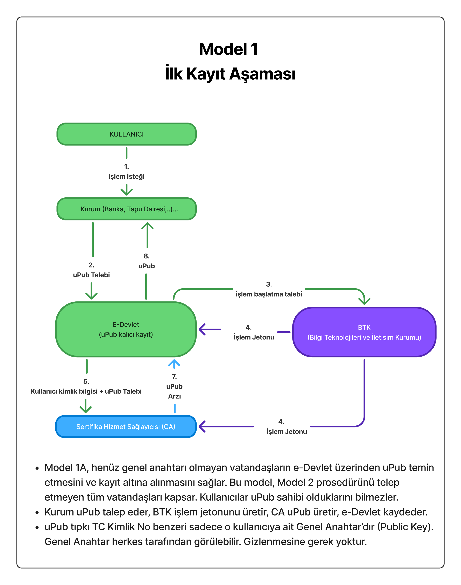

# Ephemeral E-İmza Sistemi Whitepaper

## 1. Giriş

Dünyada henüz hiçbir ülkede uygulanmayan, Türkiye’yi dijital imza teknolojisinde takip eden değil **takip edilen** ülke konumuna taşıyacak devrimsel bir protokol: **Ephemeral E-İmza Sistemi**.

Bugün Türkiye’de e-imza kullanım oranı %5’in altında ve vatandaşlar donanım maliyetleri (500-1500 TL) ve karmaşık süreçler nedeniyle e-imza kullanmaktan uzak duruyor. Üstelik mevcut modelde yıllarca geçerli anahtarların çalınması hâlinde geçmiş ve gelecek tüm işlemler tehlikeye girebiliyor.

Ephemeral E-İmza sistemi, bu paradigmada devrim yaratır: Kullanıcı belgeleri imzalamak yerine yalnızca işlemleri onaylar. Belgeyi bu işleme özel **CA (Sertifika Hizmet Sağlayıcısı)** imzalar ve tek kullanımlık bir anahtar çifti (nPriv/nPub) ile güvence altına alır. Böylece her işlem birbirinden izole edilir, donanım maliyeti sıfırlanır ve devlet altyapısına ek maliyet doğmadan **80 milyon vatandaşın e-imza sahibi olması mümkün hale gelir**.

## 2. Mimarinin Temel İlkeleri

* **Kullanıcı belgeyi imzalamaz, yalnızca onay verir.**
* **CA her işlem için yeni bir anahtar çifti (nPriv/nPub) üretir** ve belgeyi nPriv ile imzalar.
* **nPriv işlem sonunda imha edilir** → geçmiş/gelecek işlemler birbirinden izole.
* **CA kimlik bilgisi saklamaz**, yalnızca uPub ve e-Devlet’ten gelen imzalı kimlik kanıtını tutar.
* **Yetki ayrımı:** Kimlik doğrulama e-Devlet’te, token üretimi BTK’da, imza CA’da, kayıt kurumda.

Bu tasarım sayesinde hiçbir taraf tek başına tüm verilere ve anahtarlara sahip olmaz. Tam bir **kriptoloji döngüsü** ve dağıtık güven modeli oluşur.

## 3. Modeller

### Model 1A – İlk Kayıt

Kullanıcının ilk kez sisteme kayıt olduğu aşamadır. Kullanıcı e-Devlet üzerinden uPub talep eder, BTK işlem jetonunu üretir, CA uPub’ı oluşturur ve e-Devlet’e kaydeder. CA kullanıcıya ait açık kimlik bilgisini saklamaz, yalnızca uPub + e-Devlet imzalı kayıt kanıtını saklar.

### Model 1B – İşlem Aşaması

Artık e-Devlet süreç dışında kalır. Kullanıcı kurum ile işlem başlatır, BTK işlem jetonu üretir, CA kullanıcının onayını doğrular, nPriv/nPub üretir ve belgeyi imzalar. nPriv işlem sonunda imha edilir.

### Model 2 – İzole Çalışma Alanı Protokolü

Kullanıcının cihazında izole bir çalışma alanı (sandbox) oluşturulur. CA nPub üretip kullanıcıya gönderir. Kullanıcı nPub’ı kendi uPriv’u ile imzalar (signed nPub). CA signed nPub’ı kullanıcının uPub’ı ile doğrular, böylece kullanıcının onayı kanıtlanır. CA belgeyi nPriv ile imzalar, nPriv’i imha eder, kuruma nPub + geçici sertifika + imzalı belge gönderilir.

### Model 3 – Hibrit Model

Bu model, mevcut e-imza sahiplerinin sisteme entegrasyonu içindir. Kullanıcı mevcut e-imzasıyla yalnızca onay verir, belgeyi doğrudan imzalamaz. CA bu onayı doğrular, nPriv/nPub üretir ve belgeyi nPriv ile imzalar. Böylece kullanıcı anahtarının sızması durumunda bile sadece ilgili işlem tehlikeye girer.

## 4. Güvenlik ve Gizlilik Modeli

Bu protokolde CA, kullanıcıların **açık kimlik bilgilerini saklamaz**. Kimlik doğrulama yalnızca e-Devlet tarafından yapılır. CA sadece uPub + kimlik kanıtı tutar ve ileride bir denetim gerektiğinde e-Devlet API’si üzerinden kimlik doğrulaması yapılır.

Bu yaklaşım sayesinde:

* **PII sızıntısı riski minimumdur.**
* CA bir saldırı hedefi olmaktan çıkar.
* Kimlik yönetimi devlette kalır, CA sadece teknik bir imzalama servisi olarak çalışır.

## 5. Kriptolojik Zincir

* Kullanıcı uPriv ile yalnızca **onay imzası** atar.
* CA bu onayı doğrular, nPriv/nPub üretir.
* Belge **nPriv** ile imzalanır, **nPub** ile doğrulanabilir.
* Kuruma teslim edilen çıktı: **İmzalı Belge + nPub + Geçici Sertifika**.

Bu yapı tam bir kriptoloji döngüsü oluşturur ve tek imza → tek işlem paradigmasını sağlar.

## 6. Avantajlar

* **Dağıtık Güven:** Hiçbir taraf tek başına tam yetkiye sahip değildir.
* **Yüksek Güvenlik:** Her işlem bağımsızdır, anahtar sızıntısı zincirleme risk oluşturmaz.
* **Ekonomik:** Devlete ek maliyet doğurmadan 80 milyon vatandaş e-imza sahibi olabilir.
* **Mahremiyet:** CA kimlik bilgilerini saklamaz, veri ihlali riski minimumdur.

## 7. Sonuç

Ephemeral E-İmza Sistemi, klasik e-imza modelinden farklı olarak kullanıcıların yükünü ortadan kaldırır, işlemleri izole eder ve Türkiye’yi dijital imza teknolojisinde dünyada lider konuma taşıyabilecek bir altyapı sunar.
