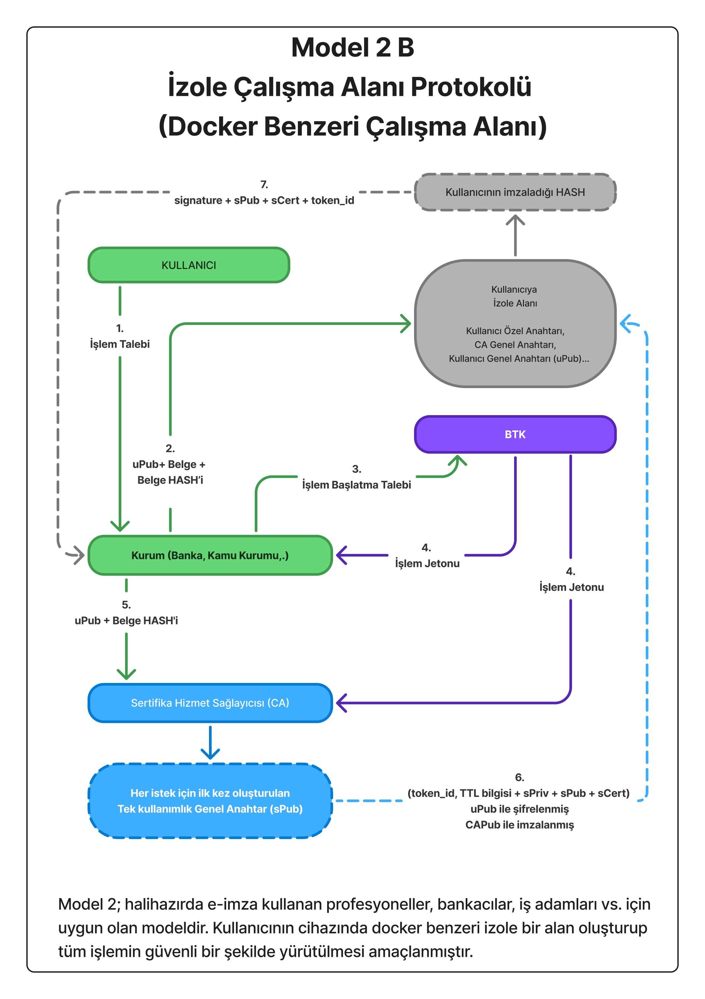
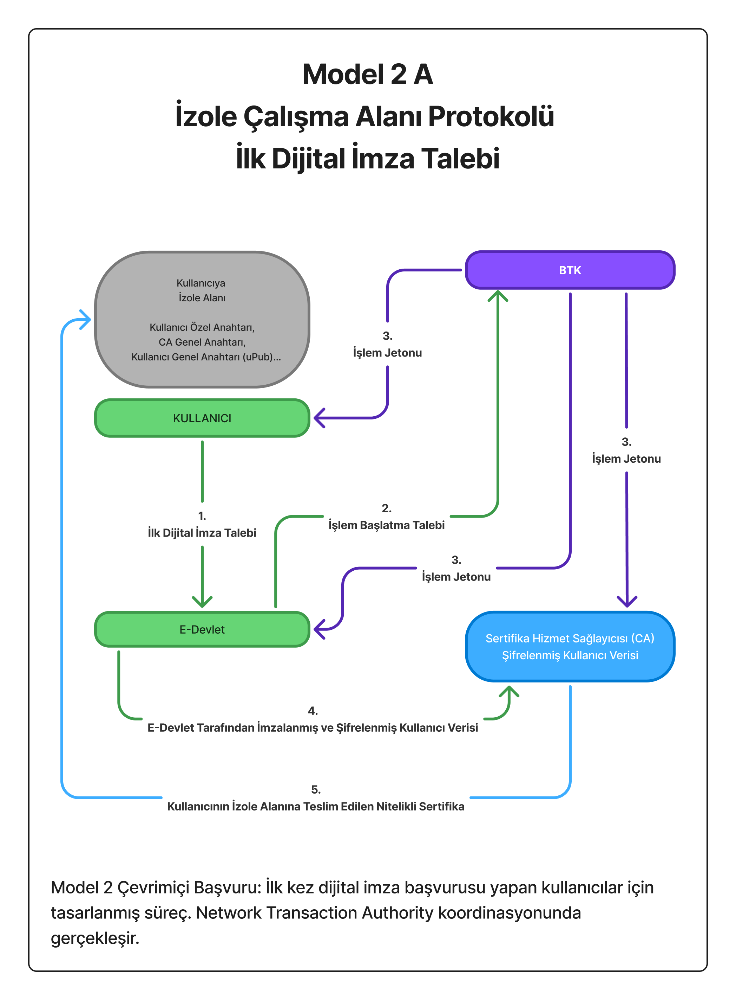

# Ephemeral E-İmza Protokolü 
## Özet
Bu çalışma, mevcut elektronik imza altyapısına yeni bir bakış açısı getirerek **tek işlem → tek anahtar → tek imza** prensibini hayata geçirir.  
Klasik e-imza sistemlerinde 3 yıl geçerli bir özel anahtar ile yapılan tüm işlemler aynı güvenlik köküne bağlıdır.  
Bu, anahtarın ele geçirilmesi durumunda geçmiş ve gelecek tüm işlemlerin tehlikeye girmesi anlamına gelir.  

**Ephemeral E-İmza Protokolü** ile:
- Her işlem için CA tarafından yeni (ephemeral) bir anahtar çifti üretilir.
- Kullanıcı sadece **işlemi onaylar** (belgeyi doğrudan imzalamaz).
- CA bu tek kullanımlık anahtarla belgeyi imzalar ve anahtarı imha eder.
- Böylece bir işlem tehlikeye girse bile diğer işlemler etkilenmez.

Bu yaklaşım, mevcut CA altyapısıyla tam uyumludur ve eIDAS / KVKK gibi düzenlemelerle çelişmez.

---

## Tasarım Prensipleri

### 1. Mevcut CA Modeli ile Uyum
- CA, **klasik PKI modelinde olduğu gibi** kullanıcının kimlik bilgilerini (Ad, Soyad, TC Kimlik No vb.) veritabanında saklar.
- Kimlik doğrulaması e-Devlet üzerinden yapılır; CA veriyi doğrulayıp kaydeder.
- Kimlik yönetiminde radikal değişiklik yoktur — **yenilik sadece imza paradigmasındadır**.

### 2. Ephemeral Anahtar Mantığı
- CA, her işlem için yeni bir nPriv/nPub çifti üretir.
- Kullanıcı nPub’ı kendi nPriv anahtarıyla imzalayarak işlemi onaylar.
- CA, kullanıcının onayını doğrular ve nPriv ile belgeyi imzalar.
- İşlem sonrası nPriv kalıcı olarak imha edilir.

### 3. Yetki Ayrımı ve Denetlenebilirlik
- **Kimlik doğrulama:** e-Devlet
- **İmza üretimi:** CA
- **Koordinasyon / zaman damgası:** BTK veya NTA (Network Transaction Authority)

Bu görev ayrımı, hiçbir tarafın tek başına tam kontrol sahibi olmamasını sağlar.

---

## Model 1A – İlk Kayıt Aşaması
Kullanıcının henüz uPub (kalıcı public key) sahibi olmadığı senaryoda devreye girer.  
e-Devlet üzerinden uPub talebi yapılır ve CA kullanıcının kimlik bilgilerini alıp kaydeder.

---

## Model 1B – Kullanıcı uPub Sahibi İse
Kullanıcı e-Devlet’te kayıtlı bir uPub’a sahip olduğunda e-Devlet süreç dışında kalır.  
Tüm işlem kullanıcı – kurum – CA arasında yürütülür.  
Bu model merkeziyetçilik eleştirilerine en uygun cevaptır.

---

## Model 2 – İzole Çalışma Alanı Protokolü
Profesyonel kullanıcılar (avukat, noter, banka yöneticisi vb.) için tasarlanmıştır.  
Kullanıcının cihazında Docker benzeri izole bir çalışma alanı oluşturularak işlem güvenliği en üst seviyeye çıkarılır.  
Kullanıcı, CA tarafından üretilen nPub’ı kendi nPriv ile imzalar ve bu sayede işlemi onaylar.

---

## Model 3 – Hibrit (Geçiş) Modeli
Halihazırda nitelikli e-imza sahibi olan kullanıcıların sisteme entegrasyonunu sağlar.  
Kullanıcı mevcut cihazıyla işlemi **onaylar**, CA geçici anahtar üretip belgeyi imzalar.  
Bu sayede “tek imza > tüm işlemler” riskinden kurtulunur.

---

## Online E-İmza Kayıt Süreci
Bu süreç, Model 1A ve Model 2 için ilk kayıt aşamasıdır.  
Kullanıcı verisi e-Devlet tarafından imzalanarak CA’ya gönderilir.  
CA bu veriyi doğrular ve kimlik bilgisini veritabanına kaydeder.

---

## Güvenlik Modeli

| Tehdit                  | Çözüm                                                      |
|------------------------|----------------------------------------------------------|
| Özel anahtar sızıntısı | Anahtar tek işlem için geçerlidir, imza sonrası imha edilir. |
| CA insider saldırısı   | Tüm işlemler BTK/NTA tarafından zaman damgalanır ve denetlenir. |
| Kimlik sahteciliği     | e-Devlet imzalı kimlik verisi CA tarafından doğrulanır. |

---

## Hukuki Uyumluluk
- **eIDAS / ETSI TS 119 312** standartlarıyla uyumludur.
- Kullanıcının adı, soyadı ve TC’si CA tarafından tutulduğu için “tanımlanabilir kimlik” gereksinimi karşılanır.
- Tüm işlemler KVKK / GDPR kapsamında denetlenebilir ve loglanır.

---

## Sonuç
Ephemeral E-İmza Protokolü, klasik PKI altyapısına büyük bir değişiklik getirmeden **devrimsel bir güvenlik artışı** sağlar.  
Bu sayede:
- 80 milyon vatandaşın e-imza sahibi olması sağlanabilir.
- Donanım maliyetleri ortadan kalkar.
- Geçmiş ve gelecek tüm işlemler birbirinden izole edilerek risk sıfıra yakın hale gelir.

Bu model, Türkiye’yi dijital imza teknolojisinde takip eden değil takip edilen ülke konumuna taşıyacak potansiyele sahiptir.
